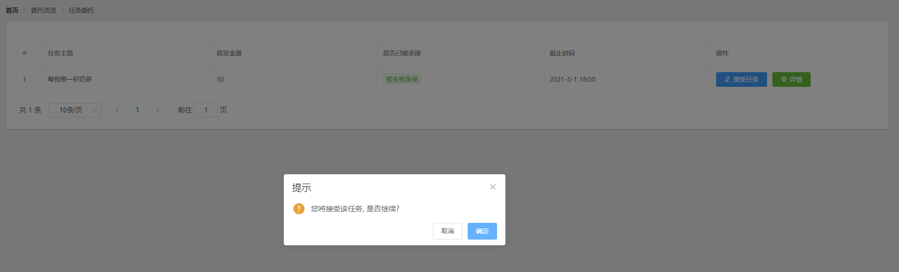

# Yorozuya

这是一个计算机软件工程课程项目——万事屋(Yorozuya)

****

## 环境配置

本项目是一个前后端分离的web项目，前端采用vue框架搭建，后端采用python轻量级flask框架实现（尝试过使用java搭建后端但因是第一次尝试前后端项目经验不足故失败...）

项目所需的运行环境包括但不限于...

- vue3.0
- python3.7
- falsk
- node.js 10.24.1
- ...

(tips：本项目使用的node.js版本需小于13.9，安装过高版本需要完全卸载后安装更新版本运行)

前端推荐使用webstorm浏览或修改源代码，命令行编译运行；

后端推荐使用pycharm编译运行（后端运行所缺依赖直接按照pycharm报红提示依次安装即可）

## 运行项目

### 前端

打开前端文件夹 `Frontend` ，进入命令行，依次输入命令 `npm install` , `npm run serve` 等待编译运行完成即可。

前端运行成功如上图，默认端口在8080.

### 后端

使用pycharm导入整个后端文件夹 `Backend` 作为新项目，安装好所有依赖后直接运行 `app.py` 即可。

### 使用

前后端都正常运行后，打开浏览器访问 `http://localhost:8080/` 即可。(如该端口被占则实际端口可以查看前端运行成功界面)

## 项目功能设计

### 基础设计

本项目主要设计两个委托，问题委托与任务委托。

### 注册与登录功能

本项目使用轻量级的注册与登录方式，在注册界面直接输入账号密码点击注册即可，弹出注册成功即可，然后点击登录即可。

(注：本项目在该界面账户与密码表单自动填充账号：admin，密码：123456的信息，便于开发过程中进行调试，如有规范使用需要可在前端源码中删去自动填充)

### 个人中心功能

注册界面仅填写了账号与密码信息，可以查看自己账户的积分与余额。（开发版本，用户初始积分与余额自动分配为100）

其中，积分表示用户的活跃度，在当前仅有的功能下回答其他用户提出的问题委托时可以增加积分；余额表示用户账户上剩余的悬赏金额，用户在发布委托（问题和任务）时设置委托奖励。

修改用户信息可以进一步完善更多信息。

### 我发布的

在该栏下，共有我的问题和我的任务两个子栏，分别可以浏览自己的问题和任务，并能发布新的问题和任务。

#### 我的问题

发布问题界面如下

发布新问题后，在我的问题界面如下，可以查看问题的状态与问题的回答

查看对应的回答界面如下，可以点击右侧按钮选择最佳答案并分配赏金

分配赏金后，问题状态变为已结束

结束后的任务仍然可以查看回答，且会保留之前结束问题时的最佳答案选择

#### 我的任务

发布任务界面与发布问题类似，浏览我的任务委托面如下

委托如已被其他用户承接则状态会改变。

### 委托浏览

委托浏览栏目类似于广场区域，可以浏览所有用户发布的问题与任务。

这里以另一个用户alice的视角展示各界面。

#### 问题委托

点击详情可以查看问题详细描述

点击提交回答可以提交自己的回答

#### 任务委托

任务委托界面如下

点击接受委托后该委托状态即会改变，且接受任务按钮会不再可用

## 算法模块

本项目的添加回答功能采用了分词算法匹配敏感词过滤的方式进行回答筛选，分词算法将汉字文本切分成一个个单独的词，处理后的数据可以用于关键字筛选过滤。（使用hanlp）

### 算法原理

#### **构建词网**

- 根据待分词的文本使用双数组树对一元核心词典进行最大匹配查询，将命中的词创建一个Vertex对象，然后添加到词网中。
- 根据二元核心词典查询两个词之间的词共现频率，来给路径添加权值。

以”商品和服务“这句话为例，可以构建如下词网。

#### **最短路径分词**

- 计算出起始顶点到词图中各个顶点的最短路径的权值。然后从结束顶点开始，回溯找到最短路径上的各个结点。
- 根据Config中的相应配置：是否开启数字识别、NER命名识别，将最终的最短路径上的分词结果输出。

其中，各顶点之间路径的权值是通过前期输入大量经过人工分词的中文语言材料进行训练得到的概率统计值，原理参考贝叶斯公式
$$
P(A|B) = \frac{P(A,B)}{P(B)} = \frac{count(A,B)}{count(B)}
$$
其中count(A,B)表示词A和词B在语料库中共同出现的频率，count(B)表示词B在语料库中出现的频率。有了这两个频率，就可以计算在给定词B的条件下，下一个词是A的概率，概率越高则权值越低，有了路径权值，自然可以找出最短路径并进行分词。

### 算法使用

以”一台独角戏“和”我是台独“两句话为例来展示分词算法的效果。

”一台独角戏“的分词效果如下：（下一列是开发测试时添加的敏感词库，可以忽略）

”我是台独“的分词效果如下：

可以看到前者虽然有”台“和”独“两个字的连续使用，但在分词后并未输出”台独“，原因在于后续的分词”角戏“不属于汉语言使用的高频词甚至几乎没有这种说法，导致最后的分词结果还是偏向于汉语言使用常规的，而后者则很轻易地分出了敏感词。
